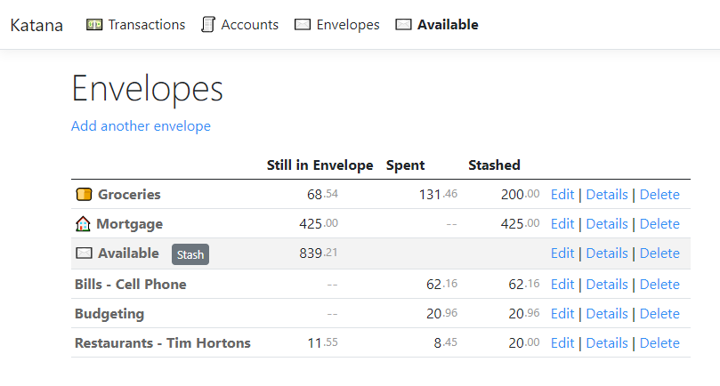
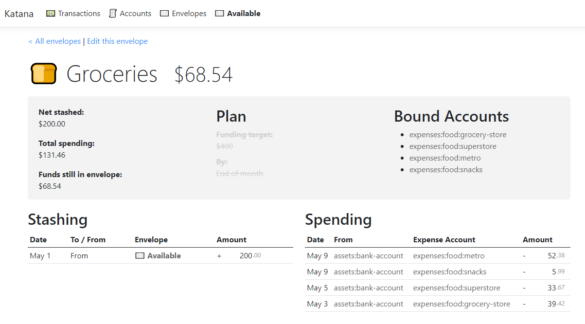
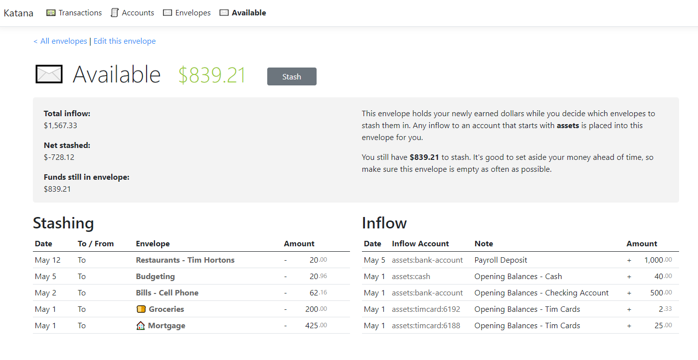
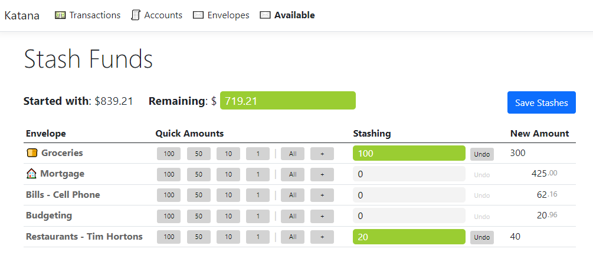

Katana is friendly budgeting software based around the envelope metaphor. It is in early stages of development and is not yet deployed on the web, however it's already usable locally for its main purpose, which is to help you divide your main account into many smaller sub-accounts (called envelopes) that are set aside for one expense each.

# Screenshots

The envelopes page shows all the envelopes in your budget, each with its own purpose. In my own budget I have almost 50 envelopes, which would be impractical to track effectively without software. The screenshots below show sample data I made up for this demo. The envelopes page shows where all your money currently is and what it's waiting on. At a glance you can tell how much is still in an envelope after all the expenses for it have been counted.

## Envelope View

Clicking on an envelope takes you to the Envelope View. In the software I currently use for budgeting (YNAB) this information is scattered in different places and you have to click a couple times to see it all. Katana shows summary numbers on the left, a (to be implemented) plan section in the middle, and a Bound Accounts section on the right. With Katana, you bind expense accounts to an envelope. In the below screenshot, four food expense accounts all roll to the Grocery budget as shown, so anything spent to those accounts is automatically removed from the Groceries envelope. This is a bit different than in YNAB where you manually categorize each entry in your transaction registers and there's no concept of binding an account to a category.

Below the info section is a list of times you've stashed money in this particular envelope, and a list of individual expense outflows to accounts that are bound to it. A net available amount (what's left in the envelope to spend) is listed at the top beside the envelope label.

## Available

The Available envelope is a special envelope that is included automatically in every new Katana budget. This is the amount of money you've earned that you've not yet assigned to a certain envelope. There's a blurb on the page reminding you to prioritize stashing your funds as soon as you get them.

In YNAB this number is magically there at the top of the screen and you have to remember where it came from. On the Available envelope view all the numbers that make up your Available amount are in plain view. The Inflow-only table is new and shows you at a glance where all your money came from.

## Stash Funds

Putting money into an envelope is uncreatively called "stashing". Clicking the Stash button on the Available screen takes you to the Stash Funds page. This is a new feature that lets you experiment with different envelope assignments until you're happy with your plan. In YNAB each assignment of funds is its own individual operation and the effect on your available number is immediate. In the below screenshot I'm considering adding $100 to my grocery envelope and $20 to the Tim Hortons one.

The New Amount column is a bit buggy but will receive a lot more attention once the Plans/Targets feature is in place, since it will show the impact of the stashing on your overall plan/target and not just the balance change.

## Entering Transactions

Transaction data is currently entered in ledger-file format with each individual debit/credit on its own line. I still keep a text file with all my entries manually entered, so I'm currently just copy/pasting to a big textbox when I'm ready to transfer the info to Katana. So it's not yet very user friendly to get account data into Katana, but lots of attention is planned for that page as well.

## Intervals

Other budget software is based on and hard-coded around monthly intervals. The current plan is to let the user roll their numbers over whenever they want with a button click. If they still want the monthly paradigm they can roll their numbers on the first of every month, but for some people it may make more sense to do it bi-weekly, every time they get paid, or just never at all, letting the numbers accrue.
